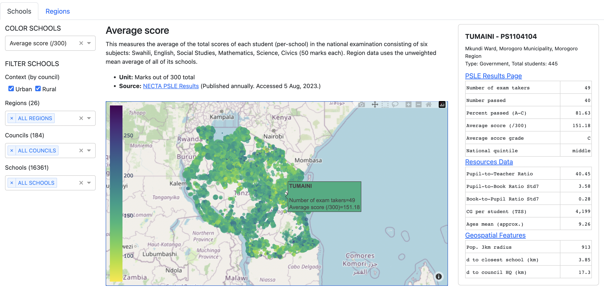

<p align="center">
<b><a href="#summary">Summary</a></b>
|
<b><a href="#data-sources-and-methodology">Data Sources and Methodology</a></b>
|
<b><a href="#project-documentation">Project Documentation</a></b>
|    
<b><a href="#references">References</a></b>
|    
<b><a href="#license">License</a></b> 
</p>

# NECTA PSLE Dashboard
This repository at https://github.com/lonnychen/necta-psle-dashboard contains the notebooks and data used by the Data Safari team to create the dashboard publicly accessible at https://bit.ly/psle2022mvp.

Data Safari is a group of passionate young Tanzanian data enthusiasts (NGO application in progress) with a mission to "utilize the power of data to make informed decisions and solve community problems." Please reach out to us at hello@datasafari.io for project feedback, questions, and collaboration.

## Summary

### Inspiration
Every year in Tanzania, the publication of Primary School Leaving Examination (PSLE) results is a national data moment for students, parents, teachers, schools, and the government, traditionally determining placement of standard seven leavers into secondary school. Student results are found on per-school web pages but **open access** to wider analysis such as urban vs. rural or regional comparisons, beyond the now de-prioritized rankings, is still needed. Further **linking results to resources data**, and geographical features provides an untapped opportunity to **make data useable** to inform policy decisions, and improve educational outcomes <a href="#references">[1]</a></b>.

### Dashboard
Our solution is a publicly accessible data dashboard that is intuitive and attractive to the general public, and flexible and powerful enough to enable deep technical analysis. By providing a platform for anyone to discover data-driven insights, we hope to contribute to systematic data-driven improvements in the education sector in Tanzania, and collaborate with and inspire others to do the same globally. Dashboard features include:
- **Interactive maps** to visualize and access data at school and region levels
- **Analysis tab** for univariate and bivariate data exploration **(in development)**
- **Prediction tab** for machine learning predictions **(in development)**

### Users
Specific user groups include:
- **Government education authorities:** policy evaluation and setting
- **School administrators:** resource review and advocacy
- **Education sector funders and NGOs:** target funding gaps
- **Researchers:** expedite their own analysis needs

## Data Sources and Methodology

- **National Examinations Council of Tanzania (NECTA):** This council adminsters and publshes PSLE (and other exams) data on their [PSLE Results](https://necta.go.tz/psle_results) portal. Going down the administrative divisions, the individual school pages are found, for example here for [Jitegemee Primary School](https://onlinesys.necta.go.tz/results/2022/psle/results/shl_ps1104063.htm) in Morogoro Municipality, Morogoro Region. We webscraped all of these pages, resulting in a DataFrame of **16,361 goverment schools** with non-missing results data.
<br><br>
- **President's Office - Regional Administration and Local Government (TAMISEMI):** This central authority for coordinating regional and local development initiatives collects and publishes per-school resources, ages, and gender data annually, here for [Basic Education Data 2022](https://www.tamisemi.go.tz/singleministers/basic-education-data-2022). A key task was to merge schools between the NECTA and TAMISEMI datasets first using NECTA (exam centre) ID then a second pass by \[school, council\] names.
<br><br>
- **Feature Extraction:** Geographical and demographical variables were extracted based school coordinates (government-only) as potential factors in performance <a href="#references">[2]</a></b>, including [population density data from Meta](https://dataforgood.facebook.com/dfg/tools/high-resolution-population-density-maps).
<br><br>
- **Data Cleaning Apporach:** We cleaned data as immediately as possible for downstream requirements. Tasks included:
    - Correct duplicated or incorrect NECTA IDs > correct before 1st pass merging
    - Equalize mismatching school names > correct before 2nd pass merging
    - Correct latitude/longitude coordinates > correct before feature extraction

## Project Documentation

Two documents are useful to understand the data used:
- [data_dictionary.xlsx](data_dictionary.xlsx): per-column notes
- [data_provenance.xlsx](data_provenance.xlsx): per-dataflow step notes
    
Jupyter notebooks are used to run project code. Some documentation conventions:
- **Learnings**: 🧑🏻‍💻 Python and libraries | 📚 Machine Learning | 😎 Cool concepts | ⚠️ Gotchas!

## References

1. [Rossiter, J. (2020). Link It, Open It, Use It: Changing How Education Data Are Used to Generate Ideas, CGD Notes.](https://www.cgdev.org/publication/link-it-open-it-use-it-changing-how-education-data-are-used-generate-ideas)
2. [HakiElimu. (2019). Exploration of factors that hinder and facilitate best performance in Primary School Leaving Examinations Tanzania: Lessons from poor and best performing regions.](https://hakielimu.or.tz/download/exploration-of-factors-that-hinder-and-facilitate-best-performance-in-primary-school-leaving-examinations-tanzania/)

## License
This project is licensed under the MIT License. Please see the [LICENSE](LICENSE) file for details.


```python

```
